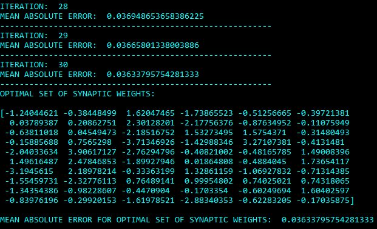

# PSO-black-box-optimization

Koristeći programski jezik Python, potrebno je implementirati PSO (Particle Swarm Optimization) algoritam, i iskoristiti ga za pronalaženje optimalnog vektora sinaptičkih težina za datu veštačku neuronsku mrežu. Potrebno je pronaći vektor sinaptičkih težina za koji funkcija date neuronske mreže, optimality_criterion, ima minimalnu vrednost, kao i tu minimalnu vrednost koja predstavlja srednju apsolutnu grešku.

## Rezultati

Primer dobijenog rezultata nakon jednog pokretanja fajla main.py (broj čestica i iteracija je 30, a interval pretrage [-5, 5]) :

Dobijeni rezultati su zadovoljavajući. PSO se pokazao kao dobar algoritam za rešavanje problema ovog tipa.
Isprobavanjem nekoliko različitih intervala pretrage došli smo do zaključka da je, za dati problem, najpogodnije koristiti interval [-5, 5]. Povećanjem broja iteracija (npr. 100), rešenje se neznatno poboljša s obzirom na povećanje vremena izvršavanja programa. Slično, povećanjem broja čestica (npr. 60), rešenje je gotovo isto kao i za 30 čestica, s tim što se vreme izvršavanja znatno poveća.

